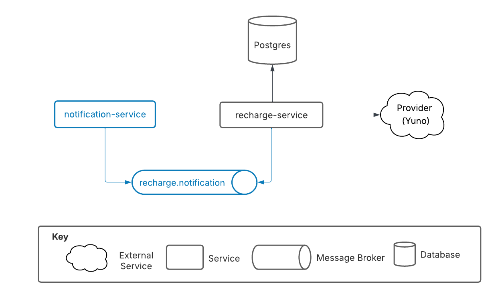

# Recharge Service

The Recharge Service is a scalable backend system designed to handle mobile phone recharge transactions for digital platforms. It provides secure authentication, transaction management and provider integration

### Key Features
- 🔐 JWT-based authentication and authorization
- 📱 Mobile recharge transaction processing
- 🏛️ Clean Architecture with Domain-Driven Design
- 🔄 External provider integration (with mock service)
- 📊 Health checks and monitoring
- 🧪 Testing (unit, integration, e2e)
- 🐳 Docker containerization
- 📈 Database persistence 

## 👥 Author

- **Santiago Jimenez Botero** - [sanjimenezbotero@gmail.com](mailto:sanjimenezbotero@gmail.com)

## 📊  Context Diagram


## 🏗️ Architecture

This project follows **Clean Architecture** principles with **Hexagonal Architecture** patterns, implementing **Domain-Driven Design (DDD)** concepts.

### Module Structure
- **Recharge Module**: Core business logic for recharge operations
- **Security Module**: Authentication and authorization
- **Infrastructure Module**: Database, configuration, and health checks
- **Yuno Mock Service**: External provider simulation

## 🤔 Technical Decisions

### 1. **Clean Architecture + Hexagonal Architecture**
- **Decision**: Implemented Clean Architecture with Hexagonal patterns
- **Justification**:
  - **Separation of Concerns**: Clear boundaries between business logic and infrastructure
  - **Testability**: Easy to unit test business logic independently
  - **Flexibility**: Can swap infrastructure components without affecting business logic
  - **Maintainability**: Code is organized by business capabilities, not technical layers

### 2. **Domain-Driven Design (DDD)**
- **Decision**: Applied DDD principles with Value Objects and Domain Entities
- **Justification**:
  - **Business Focus**: Code reflects business language and concepts
  - **Value Objects**: Phone numbers and amounts have business rules and validation
  - **Domain Entities**: Recharge represents a core business concept
  - **Ubiquitous Language**: Consistent terminology across codebase

### 3. **Microservice Architecture**
- **Decision**: Separated recharge service and mock provider into different services
- **Justification**:
  - **Scalability**: Services can be scaled independently
  - **Resilience**: Failure in one service doesn't affect others
  - **Technology Diversity**: Each service can use optimal technology stack
  - **Team Independence**: Different teams can work on different services

### 4. **Docker Containerization**
- **Decision**: Full Docker support with multi-stage builds
- **Justification**:
  - **Consistency**: Same environment across development, testing, and production
  - **Isolation**: Services run in isolated containers
  - **Deployment**: Simplified deployment process
  - **Resource Efficiency**: Multi-stage builds reduce image size

## 🚀 Future Improvements

### Event-Driven Architecture Enhancements

#### **1. Message Broker Integration**
- Add RabbitMQ/Kafka producer to publish events to topics

#### **2. Notification Service**
- Create separate microservice to consume recharge events
- Send SMS/Email notifications to users

#### **3. Event Consumer Pattern**
- Implement consumer pattern for processing distributed events
- Add retry logic and error handling

#### **4. Pending Transactions Job**
- Create cron job to check pending recharges
- Auto-update status by consulting external provider

#### **5. Additional Enhancements**
- Dead Letter Queue for failed events
- Event monitoring and metrics
- Circuit breaker for external provider calls


## 📋 Prerequisites

- **Node.js** >= 20.0.0
- **npm** >= 10.0.0
- **Docker** >= 24.0.0 (optional, for containerized deployment)

## 🚀 Installation
If you want test in the postman folder you will find a collection with all the endpoints to test the services.
[Collection](docs/postman/recharge-service.postman_collection.json)
### 🧑‍💻 Quick Start with Scripts

```bash
# Install dependencies and run tests for both services
chmod +x start_services.sh
chmod +x stop_services.sh

./start_services.sh
#If you want to stop the services later
./stop_services.sh 
```

### 🐳 Docker Deployment
Using Docker Compose to set up both the Recharge Service and the Yuno Mock Service.
```bash
# Start all services with Docker Compose
docker-compose up -d

# View logs
docker-compose logs -f

# Stop services
docker-compose down
```

### 🏠 Local Development Setup


1. **Install dependencies for main service**
   ```bash
   cd recharge-service
   npm install
   npm run start:dev
   ```

2. **Install dependencies for mock service**
   ```bash
   cd ../yuno-mock-service
   npm install
   npm run start:dev
   ```


## 📚 API Documentation

### Base URLs
- **Recharge Service**: `http://localhost:3002`
- **Mock Service**: `http://localhost:3001`

## Entry Points

### Rest

| **Method** | **Path**              | **Description**                                 | **Parameters**           | **Samples**                                                                |
|------------|-----------------------|-------------------------------------------------|--------------------------|----------------------------------------------------------------------------|
| POST       | /auth/login           | Authenticates the user and returns a JWT          | username, password       | [Login Request](docs/samples/login-request.json)           |
| POST       | /recharges/buy        | Processes a mobile recharge transaction                 | phoneNumber, amount      | [Buy Recharge](docs/samples/buy-recharge-request.json)    |
| GET        | /recharges/history    | Retrieves the user's recharge history   | Authorization (header)   |      |
| GET        | /health               | Checks the health status of the service       |                          |    |

## 🧪 Test Scenarios for Recharge

When performing a recharge, the response depends on the last digit of the phone number:

| Last Digit   | HTTP Code | Status (`status`) | Description         |
|--------------|-----------|-------------------|---------------------|
| 0-5          | 200       | 00 (SUCCESS)      | Successful recharge |
| 6-7          | 200       | C1 (DECLINED)     | Recharge declined   |
| 8-9          | 500       | C2 (FAILED)       | Recharge error      |

Use these scenarios to validate the service behavior during your tests.


## ⚙️ Environment Variables

### Recharge Service (.env)
```env
# Database Configuration
DB_TYPE=postgres
DB_HOST=localhost
DB_PORT=5432
DB_USERNAME=recharge_user
DB_PASSWORD=recharge_password
DB_NAME=recharge_db

# JWT Configuration
JWT_SECRET=your-secret-key

# Authentication
AUTH_USER=testuser
AUTH_PASSWORD=password123

# External Services
YUNO_API_URL=http://localhost:3001/
```

## 📁 Project Structure

```
recharge-service/
├── recharge-service/                 # Main recharge service
│   ├── src/
│   │   ├── app.module.ts            # Root application module
│   │   ├── main.ts                  # Application entry point
│   │   ├── infrastructure/          # Infrastructure layer
│   │   │   ├── config/              # Configuration management
│   │   │   └── health/              # Health check endpoints
│   │   ├── recharge/                # Recharge domain module
│   │   │   ├── application/         # Use cases and application services
│   │   │   ├── domain/              # Domain entities and value objects
│   │   │   ├── infrastructure/      # Infrastructure implementations
│   │   │   │   ├── in/              # Inbound adapters (REST controllers)
│   │   │   │   └── out/             # Outbound adapters (database, APIs)
│   │   │   └── shared/              # Shared utilities and constants
│   │   └── security/                # Security and authentication
│   │       ├── application/         # Security use cases
│   │       ├── domain/              # Security domain models
│   │       └── infrastructure/      # Security infrastructure
│   ├── test/                        # E2E tests
│   ├── data/                        # SQLite database files
│   ├── coverage/                    # Test coverage reports
│   ├── Dockerfile                   # Docker configuration
│   └── package.json                 # Dependencies and scripts
├── yuno-mock-service/               # External provider mock
│   ├── src/
│   │   ├── app.module.ts
│   │   ├── main.ts
│   │   ├── health/                  # Health endpoints
│   │   └── recharge-mock/           # Mock recharge endpoints
│   └── package.json
├── bin/                             # Database initialization scripts
├── docker-compose.yml               # Multi-service orchestration
├── start_services.sh                 # Development setup script
└── README.md                        # This file
```

